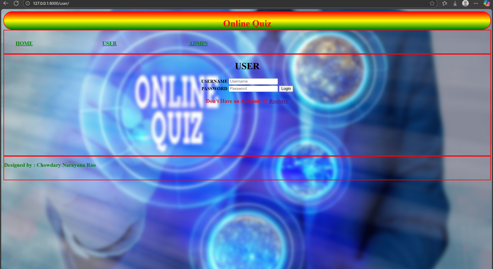
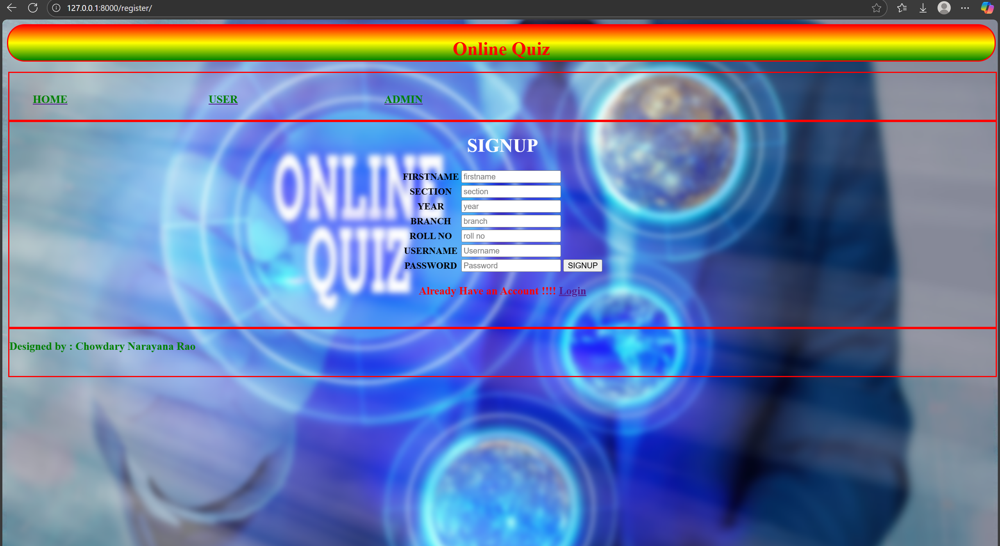
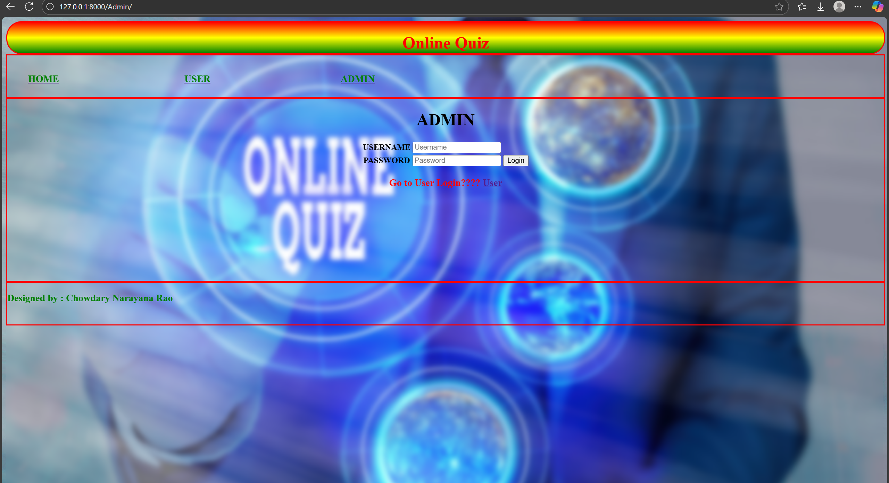

# 🧠 Online Quiz – Frontend Project with Django

A visually engaging online quiz interface built using Django, HTML and CSS. This project showcases frontend design, navigation structure, and form layouts for user and admin interaction.

---

## 🧭 Table of Contents

- [🚀 Features](#-features)
- [📸 Screenshots](#%EF%B8%8F-screenshots)
- [🛠️ Tech Stack](#%EF%B8%8F-tech-stack)
- [📦 Setup Instructions](#%EF%B8%8F-setup-instructions)
- [🙋‍♂️ About Me](#%EF%B8%8F-about-me)
- [🧪 Future Enhancements](#-future-enhancements)
- [📞 Contact](#-contact)
- [📜 License](#-license)

---

## 🎨 Features

- 🏠 Home page with vibrant header and navigation
- 👤 User login interface with registration link
- 📝 Registration form capturing academic details
- 🔐 Admin login interface with redirect to user login
- 🎨 Custom styling with background graphics and color-coded elements

---

## 🖼️ Screenshots

### 🏠 Home Page

A vibrant landing page featuring a neon-style "Online Quiz" graphic, with navigation links for Home, User, and Admin. The design sets a playful yet professional tone.

### 👤 User Login

A clean login interface for users, including fields for username and password, plus a link to register if they don’t have an account. The layout is intuitive and welcoming.

### 📝 Registration Form

A detailed signup form capturing academic details like section, year, branch, and roll number. Designed for clarity and ease of input, with a redirect to login for existing users.

### 🔐 Admin Login

A secure login page for administrators, with a redirect link to the user login. Access is restricted to authorized personnel only, ensuring protected entry to backend controls. 

---

## 🛠️ Tech Stack

| Layer      | Technology             |
|------------|------------------------|
| Framework  | Django                 |
| Structure  | HTML                   |
| Styling    | CSS                    |
| Deployment | Localhost / Custom     |
| Versioning | Git & GitHub           |

---

## ⚙️ Setup Instructions

```bash
git clone https://github.com/cnr1100/online-quiz-app.git
cd online-quiz-app
python -m venv venv
venv\Scripts\activate  # On Windows
pip install -r requirements.txt
python manage.py runserver
```

---

## 🙋‍♂️ About Me

Hi, I’m Chowdary Narayana Rao — a meticulous and security-conscious Full-Stack Developer with a passion for building clean, scalable, and data-driven applications.

### 💼 What I Do

- 🧠 Backend Development Expert in Python, Django, and SQL — building robust APIs, managing databases, and ensuring secure deployments.

- 🎨 Frontend Engineering Skilled in React — crafting responsive, user-friendly interfaces that connect seamlessly with backend logic.

- 📊 Data Analytics & BI Development Experienced in transforming raw data into actionable insights using Python, SQL, and Business Intelligence tools like Power BI and Tableau.

- 🔐 Security & Professional Presentation I follow best practices for environment management, sensitive data protection, and clean GitHub workflows — including .gitignore, licensing, and polished READMEs with icons and tables.
  
---

## 🧪 Future Enhancements

- 🔗 Connect forms to Django views and models

- ✅ Add form validation and error handling

- 📊 Implement quiz logic and score tracking

- 📱 Improve mobile responsiveness and accessibility

---

## 📬 Contact

- 📧 [cnr1100@gmail.com](mailto:cnr1100@gmail.com)

- 🔗 [LinkedIn](https://www.linkedin.com/in/cnr1100)  

- 💻 [GitHub](https://github.com/cnr1100)

---

## 📜 License

This project is licensed under the [MIT License](LICENSE).

---

